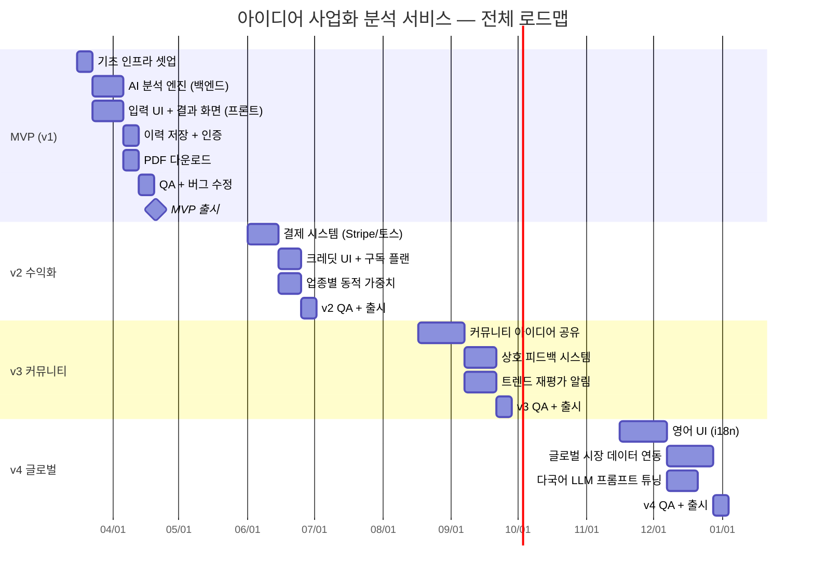
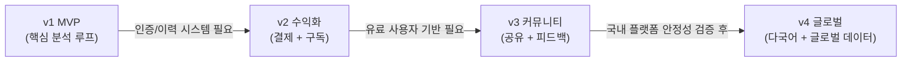
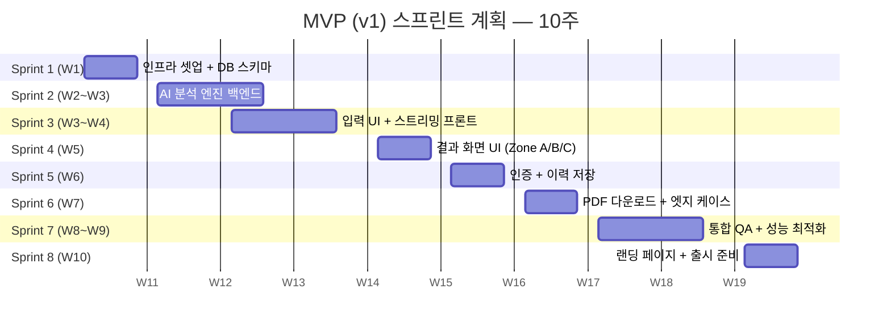

# ROADMAP — 아이디어 사업화 성공 가능성 분석 서비스

> **작성일:** 2026-03-13
> **버전:** v0.1
> **기반 문서:** [PRD v0.1](./PRD.md)
> **상태:** 초안 — 이해관계자 리뷰 후 확정 필요

---

## 목차

1. [Executive Summary — 제품 비전](#1-executive-summary--제품-비전)
2. [전체 릴리즈 계획 개요](#2-전체-릴리즈-계획-개요)
3. [Phase 1 — MVP (v1)](#3-phase-1--mvp-v1)
4. [Phase 2 — 수익화 (v2)](#4-phase-2--수익화-v2)
5. [Phase 3 — 커뮤니티 (v3)](#5-phase-3--커뮤니티-v3)
6. [Phase 4 — 글로벌 (v4)](#6-phase-4--글로벌-v4)
7. [MVP 스프린트 상세 breakdown](#7-mvp-스프린트-상세-breakdown)
8. [기술 마일스톤](#8-기술-마일스톤)
9. [리스크 레지스터](#9-리스크-레지스터)
10. [단계별 미결 사항 (Open Questions)](#10-단계별-미결-사항-open-questions)

---

## 1. Executive Summary — 제품 비전

### 핵심 가치 제안

> **"5초 안에 전문가 수준의 사업 타당성 스코어카드"**
>
> 예비 창업자, 스타트업 팀, 사이드 프로젝트 개발자가 아이디어를 입력하면
> 멀티 LLM 앙상블 AI가 **시장성 · 경쟁 강도 · 수익 모델**을 종합 분석하여
> 0~100점의 사업화 성공 확률 점수와 업종별 맞춤 인사이트를 제공한다.

### 왜 지금인가?

| 기존 대안         | 한계                                              |
| ----------------- | ------------------------------------------------- |
| VC/전문 컨설팅    | 높은 비용, 긴 대기 시간                           |
| 인터넷 검색       | 단편적이며 구조화되지 않음                        |
| ChatGPT 직접 질문 | 표준화된 평가 기준 없음, 신뢰도 낮음              |
| **본 서비스**     | **저비용 · 즉시 · 구조화된 멀티 모델 스코어카드** |

### 시장 진입 전략

```
한국 시장 검증 (v1~v2) → 국내 유료 사용자 확보 (v2) → 커뮤니티 형성 (v3) → 글로벌 확장 (v4)
```

### 최종 목표 상태 (v4 완성 시)

- 다국어(한국어 + 영어) 지원의 글로벌 아이디어 검증 플랫폼
- 구독 기반 안정 수익 모델 + 커뮤니티 생태계
- 업종별 시장 트렌드 데이터와 실시간 연동되는 동적 평가 시스템

---

## 2. 전체 릴리즈 계획 개요

### 버전별 요약

| 버전         | 테마           | 예상 기간   | 핵심 목표                             |
| ------------ | -------------- | ----------- | ------------------------------------- |
| **v1 (MVP)** | 핵심 검증 루프 | 0주 ~ 10주  | 비로그인 분석 → 결과 → PDF            |
| **v2**       | 수익화         | 11주 ~ 20주 | 결제 시스템 + 구독 플랜 + 동적 가중치 |
| **v3**       | 네트워크 효과  | 21주 ~ 34주 | 커뮤니티 + 트렌드 재평가 알림         |
| **v4**       | 글로벌         | 35주 ~ 52주 | 영어 UI + 글로벌 데이터 연동          |

### 전체 타임라인 다이어그램



### 단계 간 의존 관계



---

## 3. Phase 1 — MVP (v1)

### 3.1 목표

> **최소 기능으로 핵심 가치 제안을 검증한다.**
> 비로그인 사용자가 아이디어를 입력하고, 5초 이내에 구조화된 분석 결과와 PDF를 받을 수 있는 완전한 루프를 구현한다.

**기간:** 10주 (Week 1 ~ Week 10)

### 3.2 Feature 목록

| #   | Feature                                  | 설명                                         | 우선순위 |
| --- | ---------------------------------------- | -------------------------------------------- | -------- |
| F1  | 아이디어 입력 UI                         | 자유 텍스트 + 구조화 폼 탭 전환              | P0       |
| F2  | AI 보완 질문                             | 입력 부족 시 2~3개 보완 질문                 | P0       |
| F3  | 멀티 LLM 앙상블 분석 엔진                | Claude + GPT-4o 병렬 호출, 앙상블 집계       | P0       |
| F4  | SSE 스트리밍 결과 출력                   | Zone A/B/C 순차 스트리밍                     | P0       |
| F5  | 결과 화면 (점수 + 레이더차트 + 인사이트) | 히어로 점수, 바차트, 강점/리스크/액션        | P0       |
| F6  | 분석 이력 저장                           | 비로그인: LocalStorage 3건 / 로그인: DB 저장 | P1       |
| F7  | 회원가입 / 로그인 (Supabase Auth)        | 이메일 + 소셜 로그인                         | P1       |
| F8  | PDF 리포트 다운로드                      | 서버사이드 PDF 생성 (A4 2~3페이지)           | P1       |
| F9  | 엣지 케이스 처리                         | 타임아웃 폴백, API 오류 처리, SSE 재연결     | P1       |
| F10 | Rate Limiting                            | 무료 사용자 1일 3회 제한                     | P1       |
| F11 | 랜딩 페이지                              | 서비스 소개 + CTA                            | P2       |
| F12 | 마이페이지 (이력 조회)                   | 로그인 사용자 전체 이력 조회                 | P2       |

### 3.3 성공 기준 (KPI)

| 지표                           | 목표 (출시 후 3개월) | 측정 방법                          |
| ------------------------------ | -------------------- | ---------------------------------- |
| MAU                            | **5,000명**          | Vercel Analytics / GA4             |
| 분석 완료율                    | **≥ 70%**            | (결과 화면 도달 수 / 분석 시작 수) |
| 유료 전환율 (크레딧 관심 등록) | **≥ 5%**             | 크레딧 UI 클릭 수 / MAU            |
| 평균 스트리밍 첫 토큰 시간     | **≤ 2초**            | 서버 로그 p95                      |
| 전체 분석 완료 시간            | **≤ 5초**            | 서버 로그 p95                      |
| NPS                            | **≥ 30**             | 결과 화면 인앱 설문                |

### 3.4 MVP 이외로 연기된 항목

> 아래 항목은 MVP 범위에서 **명시적으로 제외**되며 v2 이후에 구현한다.

- [ ] 결제/크레딧 실제 과금 처리 (UI/로직은 포함, 결제 연동은 제외)
- [ ] 업종별 동적 가중치
- [ ] 이메일 알림
- [ ] 소셜 공유 기능 (링크 복사 기본 기능만 포함)
- [ ] 관리자 대시보드

---

## 4. Phase 2 — 수익화 (v2)

### 4.1 목표

> **MVP를 통해 검증된 사용자 베이스 위에 지속 가능한 수익 모델을 구축한다.**

**기간:** 10주 (Week 11 ~ Week 20)
**전제 조건:** v1 MAU 1,000명 이상 달성, 핵심 버그 없음

### 4.2 Feature 목록

| #   | Feature            | 설명                                      | 우선순위 |
| --- | ------------------ | ----------------------------------------- | -------- |
| F13 | 결제 시스템 연동   | Stripe 또는 토스페이먼츠                  | P0       |
| F14 | 크레딧 구매 플로우 | 스타터/스탠다드/프로 패키지               | P0       |
| F15 | 크레딧 잔액 관리   | 차감/충전/잔액 표시                       | P0       |
| F16 | 구독 플랜 (월정액) | 무제한 분석 + 이력 관리 + 업종 비교       | P1       |
| F17 | 업종별 동적 가중치 | 업종별 평가 항목 동적 추가 (F&B, SaaS 등) | P1       |
| F18 | 업종 비교 리포트   | 동일 업종 내 분석 결과 비교               | P2       |
| F19 | 관리자 대시보드    | 사용량, 매출, 사용자 현황                 | P2       |
| F20 | 이메일 알림        | 분석 완료 알림, 크레딧 소진 알림          | P2       |

### 4.3 크레딧 패키지 (출시 기준)

| 패키지   | 크레딧   | 가격    | 1크레딧 단가 |
| -------- | -------- | ------- | ------------ |
| 스타터   | 5크레딧  | ₩4,900  | ₩980         |
| 스탠다드 | 15크레딧 | ₩9,900  | ₩660         |
| 프로     | 50크레딧 | ₩24,900 | ₩498         |

### 4.4 성공 기준 (KPI)

| 지표               | 목표 (v2 출시 후 2개월) | 측정 방법              |
| ------------------ | ----------------------- | ---------------------- |
| 유료 전환율        | **≥ 5%**                | 크레딧 구매자 수 / MAU |
| 월 반복 수익 (MRR) | **₩500,000**            | Stripe/토스 대시보드   |
| 크레딧 재구매율    | **≥ 20%**               | 2회 이상 구매자 비율   |
| 구독 플랜 가입률   | **≥ 1% of MAU**         | DB 쿼리                |

### 4.5 v1 → v2 의존성

- Supabase `credits` 테이블 스키마는 v1에서 미리 생성 (데이터 마이그레이션 방지)
- v1의 크레딧 UI 컴포넌트 (잔액 표시, 소진 경고)는 v2 결제 연동 전 준비
- Rate Limiting 로직을 크레딧 시스템으로 전환하는 마이그레이션 계획 수립

---

## 5. Phase 3 — 커뮤니티 (v3)

### 5.1 목표

> **사용자 간 상호작용을 통해 네트워크 효과를 창출하고 플랫폼 체류 시간을 늘린다.**

**기간:** 14주 (Week 21 ~ Week 34)
**전제 조건:** v2 MRR ₩500,000 이상, 누적 분석 건수 10,000건 이상

### 5.2 Feature 목록

| #   | Feature                 | 설명                                  | 우선순위 |
| --- | ----------------------- | ------------------------------------- | -------- |
| F21 | 아이디어 공개 공유      | 분석 결과를 커뮤니티에 공개 게시      | P0       |
| F22 | 상호 피드백 시스템      | 타 사용자 아이디어에 댓글/투표        | P0       |
| F23 | 아이디어 피드           | 업종별/점수별 공개 아이디어 탐색      | P1       |
| F24 | 시장 트렌드 재평가 알림 | 저장된 아이디어를 시장 변화 시 재분석 | P1       |
| F25 | 북마크 / 팔로우         | 관심 아이디어 저장, 사용자 팔로우     | P2       |
| F26 | 사용자 프로필           | 공개 분석 이력 + 피드백 이력          | P2       |

### 5.3 성공 기준 (KPI)

| 지표                           | 목표 (v3 출시 후 3개월) | 측정 방법          |
| ------------------------------ | ----------------------- | ------------------ |
| 커뮤니티 공개 게시 아이디어 수 | **1,000건**             | DB 쿼리            |
| 주간 활성 피드백 사용자 수     | **MAU의 10%**           | 이벤트 로그        |
| 재방문율 (7일 이내)            | **≥ 30%**               | GA4                |
| 트렌드 알림 오픈율             | **≥ 25%**               | 이메일/푸시 플랫폼 |

### 5.4 주요 트레이드오프 및 고려사항

- **콘텐츠 모더레이션:** 불법/비윤리적 아이디어 공개 시 자동 필터링 + 신고 기능 필요
- **피드백 품질:** 단순 좋아요가 아닌 구조화된 피드백 유도 (항목별 투표)
- **개인정보:** 공개 아이디어에 민감 비즈니스 정보 포함 시 사용자 책임 고지 필요

---

## 6. Phase 4 — 글로벌 (v4)

### 6.1 목표

> **한국 시장 검증 완료 후 영어권 시장으로 진출하여 사용자 기반을 글로벌로 확장한다.**

**기간:** 18주 (Week 35 ~ Week 52)
**전제 조건:** v3 MAU 20,000명 이상, 플랫폼 안정성 6개월 이상 유지

### 6.2 Feature 목록

| #   | Feature                   | 설명                                   | 우선순위 |
| --- | ------------------------- | -------------------------------------- | -------- |
| F27 | 영어 UI (i18n 프레임워크) | next-intl 기반 한국어/영어 전환        | P0       |
| F28 | 영어 LLM 프롬프트 최적화  | 영어 입력 → 영어 결과 출력 최적화      | P0       |
| F29 | 글로벌 시장 데이터 연동   | 해외 업종별 시장 규모 데이터 소스 연동 | P1       |
| F30 | 통화 / 결제 글로벌화      | USD/EUR 결제, Stripe 글로벌            | P1       |
| F31 | 글로벌 마케팅 랜딩 페이지 | SEO 최적화 영어 랜딩 페이지            | P2       |
| F32 | 시간대 / 지역 설정        | 사용자 지역 기반 분석 맥락 조정        | P2       |

### 6.3 성공 기준 (KPI)

| 지표             | 목표 (v4 출시 후 6개월) | 측정 방법     |
| ---------------- | ----------------------- | ------------- |
| 해외 사용자 비율 | **MAU의 30%**           | GA4 지역 분석 |
| 영어 분석 건수   | **월 5,000건**          | DB 언어 분류  |
| 글로벌 MRR 기여  | **전체 MRR의 20%**      | 결제 플랫폼   |

---

## 7. MVP 스프린트 상세 breakdown

> 스프린트 단위: 1주 (5일 기준)
> 팀 구성 가정: 프론트엔드 1명, 백엔드/AI 1명, 풀스택/PO 1명 (소규모 스타트업 기준 조정 가능)

### 스프린트 개요



---

### Sprint 1 — 기초 인프라 셋업 (Week 1)

**목표:** 개발 환경 완성, 핵심 인프라 구성, DB 스키마 배포
**상태:** ✅ 완료 (2026-03-13)

| 티켓    | 작업                                                   | 담당   | 완료 기준                                            | 상태 |
| ------- | ------------------------------------------------------ | ------ | ---------------------------------------------------- | ---- |
| INF-001 | Next.js 14 + Tailwind CSS 프로젝트 초기화              | 풀스택 | `npm run dev` 정상 실행                              | ✅   |
| INF-002 | Vercel 프로젝트 생성 + GitHub CI/CD 연결               | 풀스택 | main 브랜치 푸시 시 자동 배포                        | ✅   |
| INF-003 | Supabase 프로젝트 생성 + `analyses` 테이블 스키마 배포 | 백엔드 | 테이블 생성 확인, RLS 정책 초안 적용                 | ✅   |
| INF-004 | `credits` 테이블 스키마 생성 (v2 선준비)               | 백엔드 | 테이블 생성 확인                                     | ✅   |
| INF-005 | 환경 변수 관리 (.env.local + Vercel 환경 변수)         | 풀스택 | Claude API 키, OpenAI API 키, Supabase URL 설정 완료 | ✅   |
| INF-006 | ESLint + Prettier + TypeScript strict 설정             | 풀스택 | 린트 에러 0건                                        | ✅   |

---

### Sprint 2 — AI 분석 엔진 백엔드 (Week 2~3)

**목표:** `/api/analyze` 엔드포인트 구현, SSE 스트리밍 작동, 멀티 LLM 앙상블 집계 로직 완성

| 티켓   | 작업                                                               | 담당   | 완료 기준                                    |
| ------ | ------------------------------------------------------------------ | ------ | -------------------------------------------- |
| BE-001 | `POST /api/analyze` 엔드포인트 스캐폴딩 (SSE 헤더 설정)            | 백엔드 | curl로 SSE 이벤트 수신 확인                  |
| BE-002 | 프리프로세싱 레이어 구현 (언어 감지, 업종 분류, 입력 품질 평가)    | 백엔드 | 샘플 5개 입력으로 업종 분류 정확도 확인      |
| BE-003 | Claude API 호출 모듈 (시장성 + 경쟁 분석)                          | 백엔드 | 단위 테스트 통과, 응답 파싱 정상             |
| BE-004 | GPT-4o API 호출 모듈 (수익 모델 분석)                              | 백엔드 | 단위 테스트 통과, 응답 파싱 정상             |
| BE-005 | Claude API 호출 모듈 (종합 인사이트 + 위험 요소)                   | 백엔드 | 단위 테스트 통과                             |
| BE-006 | 병렬 LLM 호출 오케스트레이터 (`Promise.allSettled`)                | 백엔드 | 3개 모델 병렬 호출 후 앙상블 집계 정상 동작  |
| BE-007 | 앙상블 집계 레이어 (가중 평균 점수, 불일치 재검증)                 | 백엔드 | 점수 차 >20점 시 재호출 로직 동작 확인       |
| BE-008 | SSE 스트리밍 — Zone A (점수/등급) 먼저 전송                        | 백엔드 | 브라우저에서 Zone A 먼저 렌더링 확인         |
| BE-009 | `POST /api/clarify` 엔드포인트 (보완 질문 응답 후 재분석)          | 백엔드 | 보완 질문 답변 포함 시 개선된 분석 결과 확인 |
| BE-010 | 분석 결과 Supabase DB 저장 (비로그인: session_id, 로그인: user_id) | 백엔드 | DB 레코드 정상 저장 확인                     |
| BE-011 | Rate Limiting 미들웨어 (IP 기반 1일 3회 제한)                      | 백엔드 | 4번째 요청 시 429 응답 확인                  |
| BE-012 | LLM 타임아웃 폴백 처리 (단일 모델 폴백 + 신뢰도 경고)              | 백엔드 | 타임아웃 시뮬레이션 테스트 통과              |
| BE-013 | 불법/비윤리 입력 필터링 프롬프트 + 거부 응답                       | 백엔드 | 테스트 케이스 3개 이상 통과                  |

---

### Sprint 3 — 입력 UI + 스트리밍 프론트엔드 (Week 3~4)

**목표:** 사용자가 아이디어를 입력하고 분석 진행 상태를 실시간으로 볼 수 있는 화면 구현

| 티켓   | 작업                                                           | 담당   | 완료 기준                             |
| ------ | -------------------------------------------------------------- | ------ | ------------------------------------- |
| FE-001 | 입력 페이지 레이아웃 (탭: 자유 텍스트 / 구조화 폼)             | 프론트 | 탭 전환 정상, 모바일 반응형 확인      |
| FE-002 | 자유 텍스트 입력 컴포넌트 (10자 미만 유효성 검사 포함)         | 프론트 | 짧은 입력 시 재입력 요청 메시지 표시  |
| FE-003 | 구조화 폼 컴포넌트 (필수 필드: 문제 정의, 해결 방법)           | 프론트 | 필수 필드 미입력 시 제출 불가         |
| FE-004 | "분석 시작하기" 버튼 + `/api/analyze` SSE 연결                 | 프론트 | SSE 연결 후 이벤트 수신 확인          |
| FE-005 | AI 보완 질문 모달/카드 UI                                      | 프론트 | 질문 표시 후 답변 입력 또는 스킵 처리 |
| FE-006 | 분석 중 로딩 화면 ("시장 분석 중..." → "경쟁 분석 중...")      | 프론트 | 단계별 진행 메시지 전환 확인          |
| FE-007 | SSE 재연결 로직 (네트워크 단절 시 마지막 수신 지점부터 재시작) | 프론트 | 오프라인 시뮬레이션 테스트 통과       |

---

### Sprint 4 — 결과 화면 UI (Week 5)

**목표:** Zone A / B / C 결과 화면 완성, 레이더 차트 + 바 차트 구현

| 티켓   | 작업                                                                   | 담당   | 완료 기준                                   |
| ------ | ---------------------------------------------------------------------- | ------ | ------------------------------------------- |
| FE-008 | Zone A — 히어로 점수 + 등급 뱃지 컴포넌트                              | 프론트 | 점수 애니메이션 카운트업 동작               |
| FE-009 | Zone A — 레이더 차트 (시장성/경쟁/수익 3축)                            | 프론트 | `recharts` 또는 `chart.js` 기반 렌더링 확인 |
| FE-010 | Zone B — 차원별 바 차트 + 점수 + 설명 텍스트 스트리밍                  | 프론트 | 스트리밍 텍스트 자연스러운 출력 확인        |
| FE-011 | Zone C — 강점 / 핵심 리스크 / 액션 아이템 섹션                         | 프론트 | 항목별 아이콘 + 텍스트 정렬 확인            |
| FE-012 | "어떤 근거로 이 점수를 산출했나요?" 섹션 (신뢰도 메타데이터)           | 프론트 | 사용된 모델 명 + 모델 간 일치율 표시        |
| FE-013 | 하단 액션 버튼 ([PDF 다운로드] [다시 분석하기] [공유하기 — 링크 복사]) | 프론트 | 각 버튼 동작 확인                           |
| FE-014 | 불확실성 배지 (모델 간 점수 차 > 20점 시 표시)                         | 프론트 | 배지 표시 조건 로직 동작 확인               |

---

### Sprint 5 — 인증 + 이력 저장 (Week 6)

**목표:** Supabase Auth 연동, 로그인/비로그인 이력 저장 분기 처리, 마이페이지 구현

| 티켓     | 작업                                                                       | 담당   | 완료 기준                                 |
| -------- | -------------------------------------------------------------------------- | ------ | ----------------------------------------- |
| AUTH-001 | Supabase Auth 설정 (이메일 + Google OAuth)                                 | 풀스택 | 이메일/구글 로그인 정상 동작              |
| AUTH-002 | 로그인 / 회원가입 페이지 UI                                                | 프론트 | 폼 유효성 검사 + 에러 메시지 표시         |
| AUTH-003 | 비로그인 LocalStorage 이력 저장 (최근 3건)                                 | 프론트 | 새로고침 후에도 이력 유지 확인            |
| AUTH-004 | 로그인 후 DB 이력 저장 + LocalStorage 이력 병합                            | 풀스택 | 비로그인 분석 후 로그인 시 이력 연결 확인 |
| AUTH-005 | `GET /api/analyses` 이력 목록 API (인증 필요)                              | 백엔드 | Supabase RLS로 본인 이력만 조회 확인      |
| AUTH-006 | `GET /api/analyses/:id` 특정 분석 결과 조회 API                            | 백엔드 | 타 사용자 접근 시 403 확인                |
| AUTH-007 | 마이페이지 — 이력 카드 목록 (아이디어 요약, 점수, 등급, 날짜, 재분석 버튼) | 프론트 | 카드 렌더링 + 재분석 버튼 동작 확인       |

---

### Sprint 6 — PDF 다운로드 + 엣지 케이스 처리 (Week 7)

**목표:** PDF 리포트 생성 API 완성, 주요 엣지 케이스 처리

| 티켓     | 작업                                                       | 담당   | 완료 기준                                 |
| -------- | ---------------------------------------------------------- | ------ | ----------------------------------------- |
| PDF-001  | `GET /api/analyses/:id/pdf` 서버사이드 PDF 생성 엔드포인트 | 백엔드 | A4 2~3페이지 PDF 다운로드 정상 동작       |
| PDF-002  | PDF 레이아웃 — 표지 (아이디어명, 점수, 날짜)               | 백엔드 | 렌더링 확인                               |
| PDF-003  | PDF 레이아웃 — 차원별 점수 + 레이더 차트 이미지            | 백엔드 | 차트 이미지 포함 확인                     |
| PDF-004  | PDF 레이아웃 — AI 분석 텍스트 전문 + 액션 아이템           | 백엔드 | 텍스트 줄바꿈 + 페이지 오버플로 처리 확인 |
| PDF-005  | PDF 생성 실패 시 재시도 버튼 + 텍스트 복사 대안 UI         | 프론트 | 에러 상태 표시 확인                       |
| EDGE-001 | LLM API 타임아웃 (30초) 처리 + 단일 모델 폴백              | 백엔드 | 타임아웃 시 폴백 응답 정상 동작           |
| EDGE-002 | 불법/비윤리 아이디어 거부 + 크레딧 미차감 로직             | 백엔드 | 거부 케이스 테스트 3개 이상 통과          |
| EDGE-003 | 모델 간 점수 차 >20점 재호출 로직 + 불확실성 배지          | 백엔드 | 재호출 후 평균 산출 확인                  |

---

### Sprint 7 — 통합 QA + 성능 최적화 (Week 8~9)

**목표:** E2E 테스트 완성, p95 응답 시간 KPI 달성, 주요 버그 수정

| 티켓   | 작업                                                           | 담당   | 완료 기준                      |
| ------ | -------------------------------------------------------------- | ------ | ------------------------------ |
| QA-001 | Happy Path E2E 테스트 (Playwright) — 비로그인 분석 전체 플로우 | 풀스택 | 테스트 통과                    |
| QA-002 | Happy Path E2E 테스트 — 로그인 후 이력 저장 플로우             | 풀스택 | 테스트 통과                    |
| QA-003 | p95 응답 시간 측정 — 스트리밍 첫 토큰 ≤ 2초                    | 백엔드 | k6 부하 테스트 결과 KPI 충족   |
| QA-004 | p95 응답 시간 측정 — 전체 분석 완료 ≤ 5초                      | 백엔드 | k6 부하 테스트 결과 KPI 충족   |
| QA-005 | 모바일 반응형 QA (iOS Safari, Android Chrome)                  | 프론트 | 주요 화면 레이아웃 깨짐 없음   |
| QA-006 | WCAG 2.1 AA 접근성 검사 (키보드 내비게이션, 색대비)            | 프론트 | axe DevTools 심각 오류 0건     |
| QA-007 | Supabase RLS 정책 검증 (본인 이력 외 접근 차단)                | 백엔드 | 침투 테스트 케이스 통과        |
| QA-008 | 회귀 테스트 — 엣지 케이스 시나리오 전체 재검증                 | 풀스택 | 모든 엣지 케이스 시나리오 통과 |

---

### Sprint 8 — 랜딩 페이지 + 출시 준비 (Week 10)

**목표:** 랜딩 페이지 완성, 모니터링 설정, 소프트 런치

| 티켓       | 작업                                                         | 담당   | 완료 기준                                |
| ---------- | ------------------------------------------------------------ | ------ | ---------------------------------------- |
| LAUNCH-001 | 랜딩 페이지 — 서비스 소개 + CTA ("무료로 분석해보기")        | 프론트 | SEO 메타 태그 포함, Lighthouse 점수 ≥ 85 |
| LAUNCH-002 | GA4 + Vercel Analytics 설정                                  | 풀스택 | 페이지뷰 이벤트 수집 확인                |
| LAUNCH-003 | 분석 완료율 추적 이벤트 설정 (funnel: 입력 시작 → 결과 확인) | 풀스택 | GA4 이벤트 정상 수집 확인                |
| LAUNCH-004 | Vercel 프로덕션 환경 최종 점검 (환경 변수, 도메인 설정)      | 풀스택 | 커스텀 도메인 HTTPS 접속 확인            |
| LAUNCH-005 | 에러 모니터링 설정 (Sentry 또는 Vercel Error Tracking)       | 풀스택 | 테스트 에러 캡처 확인                    |
| LAUNCH-006 | 소프트 런치 공지 (내부 테스터 20명 초대)                     | PO     | 피드백 수집 시트 준비                    |

---

## 8. 기술 마일스톤

### 8.1 아키텍처 결정 사항 (ADR)

| #       | 결정                | 선택                                  | 결정 기한               | 상태    |
| ------- | ------------------- | ------------------------------------- | ----------------------- | ------- |
| ADR-001 | PDF 생성 위치       | 서버사이드 (API Route)                | Sprint 1 이전           | ✅ 확정 |
| ADR-002 | LLM 스트리밍 방식   | SSE (단방향 스트림)                   | Sprint 1 이전           | ✅ 확정 |
| ADR-003 | 비로그인 허용 여부  | MVP에서 허용                          | Sprint 1 이전           | ✅ 확정 |
| ADR-004 | 가중치 고정 vs 동적 | MVP 고정, v2에서 동적 전환            | Sprint 1 이전           | ✅ 확정 |
| ADR-005 | 결제 게이트웨이     | Stripe vs 토스페이먼츠                | Sprint 6 이전 (v2 준비) | ⏳ 미결 |
| ADR-006 | 무료 분석 횟수 기준 | IP 기반 vs 디바이스 기반 vs 계정 기반 | Sprint 2 이전           | ⏳ 미결 |

### 8.2 인프라 마일스톤

| 마일스톤     | 목표                       | 완료 기준                              | 예상 시점 |
| ------------ | -------------------------- | -------------------------------------- | --------- |
| **INFRA-M1** | 개발/프로덕션 환경 분리    | `dev` / `main` 브랜치 별도 Vercel 배포 | Week 1    |
| **INFRA-M2** | Supabase RLS 정책 완성     | 모든 테이블 Row Level Security 적용    | Week 2    |
| **INFRA-M3** | 멀티 LLM 병렬 호출 안정화  | p95 < 5초, 에러율 < 1%                 | Week 3    |
| **INFRA-M4** | SSE 스트리밍 프로덕션 검증 | Vercel Edge Runtime에서 SSE 정상 동작  | Week 4    |
| **INFRA-M5** | 모니터링 파이프라인 완성   | Sentry + GA4 + Vercel Analytics 통합   | Week 10   |
| **INFRA-M6** | 결제 인프라 (v2)           | Stripe/토스 웹훅 + 크레딧 차감 자동화  | Week 15   |

### 8.3 프롬프트 엔지니어링 마일스톤

| 마일스톤  | 목표                             | 완료 기준                             | 예상 시점 |
| --------- | -------------------------------- | ------------------------------------- | --------- |
| **PE-M1** | 업종 분류 프롬프트               | 주요 20개 업종 분류 정확도 ≥ 85%      | Week 2    |
| **PE-M2** | 앙상블 점수 일관성               | 동일 입력 반복 시 점수 편차 ≤ 5점     | Week 3    |
| **PE-M3** | 보완 질문 품질                   | 사용자 평가 유용성 점수 ≥ 4/5         | Week 5    |
| **PE-M4** | 업종별 동적 가중치 프롬프트 (v2) | 업종별 특화 항목 추가 시 정확도 유지  | Week 14   |
| **PE-M5** | 영어 프롬프트 최적화 (v4)        | 영어 입력 분석 품질 한국어 대비 ≥ 90% | Week 38   |

---

## 9. 리스크 레지스터

> 위험도 = 발생 가능성(H/M/L) × 영향도(H/M/L)

### 9.1 기술 리스크

| #    | 리스크                                                                                   | 위험도 | 영향              | 완화 전략                                                                                                                                     |
| ---- | ---------------------------------------------------------------------------------------- | ------ | ----------------- | --------------------------------------------------------------------------------------------------------------------------------------------- |
| R-T1 | **LLM API 비용 폭발** — 멀티 LLM 앙상블의 실제 호출 비용이 예상을 초과                   | H×H    | 수익성 악화       | ① 무료 사용자 1일 3회 Rate Limiting 엄격 적용 ② 비용 모니터링 대시보드 (OpenAI/Anthropic 사용량 알림) ③ 필요 시 무료 분석을 단일 LLM으로 폴백 |
| R-T2 | **Vercel SSE 제한** — Vercel Serverless Function 실행 시간 제한(30초) 초과               | M×H    | 5초 KPI 미달      | ① Vercel Edge Runtime으로 전환 ② Streaming 최적화 ③ 최악의 경우 장기 실행 Worker 분리 (Railway, Render)                                       |
| R-T3 | **LLM 결과 품질 불안정** — 동일 입력에 대한 점수 편차 과다                               | M×H    | 신뢰도 손상       | ① temperature 낮게 설정 (0.3 이하) ② 앙상블 집계 시 이상치 제거 ③ 사용자 피드백 기반 프롬프트 지속 개선                                       |
| R-T4 | **Supabase 무료 tier 한계** — 트래픽 증가 시 DB 연결 풀 초과                             | M×M    | 서비스 중단       | ① 초기부터 커넥션 풀 설정 최적화 ② MAU 1,000명 초과 시 Supabase Pro 플랜 전환                                                                 |
| R-T5 | **PDF 생성 메모리 초과** — 서버사이드 PDF 생성 시 Vercel Function 메모리 512MB 제한 초과 | L×M    | PDF 다운로드 실패 | ① PDF 생성을 별도 경량 Function으로 분리 ② 실패 시 클라이언트사이드 폴백 제공                                                                 |

### 9.2 비즈니스 리스크

| #    | 리스크                                                                                   | 위험도 | 영향                   | 완화 전략                                                                                                              |
| ---- | ---------------------------------------------------------------------------------------- | ------ | ---------------------- | ---------------------------------------------------------------------------------------------------------------------- |
| R-B1 | **낮은 분석 완료율** — 사용자가 결과 화면까지 도달하지 못하고 이탈                       | M×H    | KPI 미달               | ① 입력 화면 UX 지속 A/B 테스트 ② 스트리밍 첫 토큰을 최대한 빠르게 (2초 이내) ③ 입력 예시 제공으로 진입 장벽 낮춤       |
| R-B2 | **낮은 유료 전환율** — 무료 3회 이후 이탈                                                | M×H    | 수익 미달              | ① 유료 기능을 명확히 차별화 (심층 분석, PDF 품질) ② 크레딧 소진 전 가치 증명 집중 ③ v2 출시 전 가격 민감도 인터뷰 수행 |
| R-B3 | **LLM 서비스 약관 위반** — 사업 아이디어 데이터를 AI 학습에 활용하는 것에 대한 법적 이슈 | L×H    | 서비스 중단, 법적 분쟁 | ① 개인정보처리방침에 데이터 활용 범위 명시 ② OpenAI/Anthropic API 약관 정기 검토 ③ 민감 정보 입력 경고 UI              |
| R-B4 | **경쟁 서비스 등장** — 유사 서비스 빠른 출시                                             | L×M    | 사용자 분산            | ① MVP 10주 내 빠른 출시로 선점 ② 커뮤니티(v3)를 통한 네트워크 효과 구축 ③ 데이터 축적 기반의 분석 품질 격차 벌리기     |

### 9.3 운영 리스크

| #    | 리스크                                            | 위험도 | 영향          | 완화 전략                                                                                                            |
| ---- | ------------------------------------------------- | ------ | ------------- | -------------------------------------------------------------------------------------------------------------------- |
| R-O1 | **악성 사용자의 API 남용** — Rate Limit 우회 시도 | M×H    | LLM 비용 폭증 | ① IP + User-Agent 복합 식별 ② Cloudflare 봇 방어 도입 ③ 이상 트래픽 알림 자동화                                      |
| R-O2 | **팀 소규모 리소스 부족** — 10주 MVP 일정 초과    | M×M    | 출시 지연     | ① MVP 기능을 최소한으로 고정 (scope creep 방지) ② Sprint 7에서 버퍼 확보 ③ 비핵심 기능(랜딩 페이지 등) 우선순위 하향 |

---

## 10. 단계별 미결 사항 (Open Questions)

### v1 MVP 착수 전 반드시 해소해야 할 항목

| #    | 질문                                                                                                                                          | 중요도 | 담당        | 결정 기한        |
| ---- | --------------------------------------------------------------------------------------------------------------------------------------------- | ------ | ----------- | ---------------- |
| OQ-1 | 무료 분석 3회 제한 기준: **IP 기반 vs 디바이스(fingerprint) 기준 vs 계정 기반** 중 무엇으로 할 것인가? 각각의 우회 가능성과 UX 영향 고려 필요 | 높음   | PO + 백엔드 | Sprint 1 시작 전 |
| OQ-2 | 멀티 LLM 앙상블의 예상 월 비용 vs 단일 LLM 비용 비교 분석. 무료 사용자 트래픽 가정 하에 BEP 산출 필요                                         | 높음   | 백엔드 + PO | Sprint 1 시작 전 |
| OQ-3 | 비로그인 분석 결과를 나중에 로그인 후 계정에 연결하는 기능을 MVP에 포함할 것인가? (사용자 경험 vs 구현 복잡도)                                | 중간   | PO          | Sprint 4 시작 전 |
| OQ-4 | 업종 자동 분류 정확도가 낮을 때 사용자 수동 보정 UI를 MVP에 포함할 것인가?                                                                    | 중간   | PO + 프론트 | Sprint 2 시작 전 |
| OQ-5 | PDF 리포트에 브랜드 워터마크 또는 "Powered by [서비스명]" 마케팅 요소를 포함할 것인가?                                                        | 낮음   | PO          | Sprint 6 시작 전 |

---

### v2 수익화 착수 전 해소해야 할 항목

| #    | 질문                                                                                                                                  | 중요도 | 담당        | 결정 기한             |
| ---- | ------------------------------------------------------------------------------------------------------------------------------------- | ------ | ----------- | --------------------- |
| OQ-6 | **결제 게이트웨이 선택:** 국내 중심이면 토스페이먼츠, 글로벌 확장 고려 시 Stripe. v4 글로벌 계획 감안 시 Stripe 조기 선택이 유리한가? | 높음   | PO + 백엔드 | v2 Sprint 시작 2주 전 |
| OQ-7 | 구독 플랜의 "무제한 분석"은 LLM 비용 관점에서 실제로 무제한인가? 또는 월 N회 상한을 두되 마케팅상 "무제한"으로 표기할 것인가?         | 높음   | PO + 백엔드 | v2 Sprint 시작 전     |
| OQ-8 | 업종별 동적 가중치 데이터 소스: 내부 프롬프트 기반인가, 외부 시장 데이터(예: 통계청, CB Insights) 연동인가?                           | 중간   | 백엔드      | v2 Sprint 시작 전     |

---

### v3 커뮤니티 착수 전 해소해야 할 항목

| #     | 질문                                                                                    | 중요도 | 담당      | 결정 기한         |
| ----- | --------------------------------------------------------------------------------------- | ------ | --------- | ----------------- |
| OQ-9  | 아이디어 공개 시 지식재산권(IP) 보호 고지 방식: 단순 안내 팝업인가, 이용 약관 동의인가? | 높음   | PO + 법무 | v3 Sprint 시작 전 |
| OQ-10 | 커뮤니티 모더레이션을 자동화(LLM 기반 필터)로만 처리할 것인가, 사람 검토가 필요한가?    | 중간   | PO        | v3 Sprint 시작 전 |

---

### v4 글로벌 착수 전 해소해야 할 항목

| #     | 질문                                                                                                       | 중요도 | 담당        | 결정 기한             |
| ----- | ---------------------------------------------------------------------------------------------------------- | ------ | ----------- | --------------------- |
| OQ-11 | 글로벌 시장 데이터 소스 확정: 어떤 API/데이터셋을 활용할 것인가? (예: Crunchbase API, Statista, 자체 수집) | 높음   | 백엔드 + PO | v4 Sprint 시작 4주 전 |
| OQ-12 | 영어 서비스의 분석 결과를 영어로만 출력할 것인가, 사용자 선택 언어로 출력할 것인가?                        | 중간   | PO          | v4 Sprint 시작 전     |

---

## 부록 — 용어 정의

| 용어   | 정의                                                                |
| ------ | ------------------------------------------------------------------- |
| MAU    | Monthly Active Users — 월간 활성 사용자 수                          |
| MRR    | Monthly Recurring Revenue — 월간 반복 수익                          |
| TAM    | Total Addressable Market — 전체 대상 시장 규모                      |
| SSE    | Server-Sent Events — 서버에서 클라이언트로의 단방향 실시간 스트리밍 |
| RLS    | Row Level Security — Supabase의 행 수준 접근 제어                   |
| BEP    | Break-Even Point — 손익분기점                                       |
| ADR    | Architecture Decision Record — 아키텍처 결정 기록                   |
| 앙상블 | 복수의 LLM 모델 결과를 집계하여 최종 점수를 산출하는 방식           |
| 크레딧 | 서비스 내 분석 1회에 소모되는 가상 통화 단위                        |

---

_이 ROADMAP은 PRD v0.1 기반 초안입니다. 미결 사항 해소 및 이해관계자 리뷰 후 Sprint 1 착수를 권장합니다._
